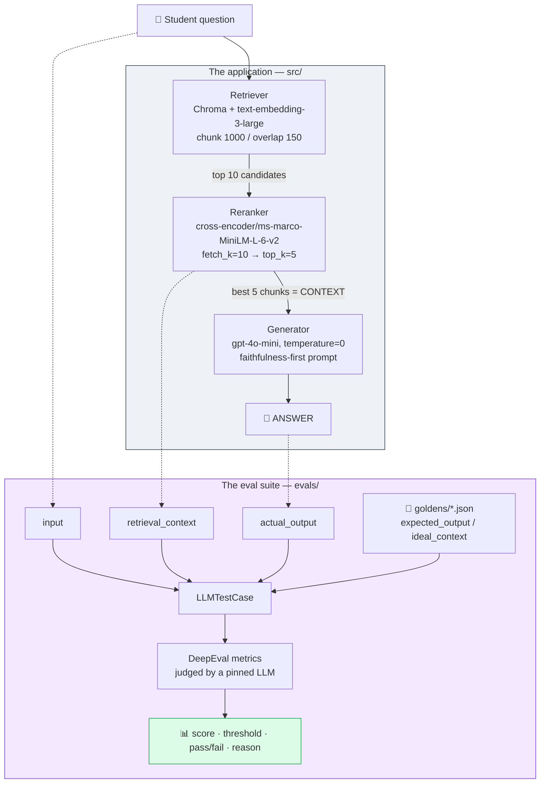
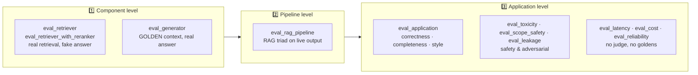
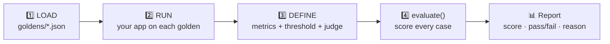
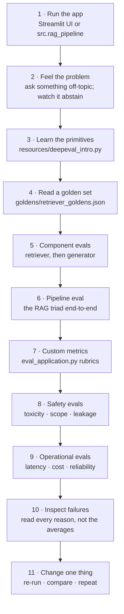

<div align="center">

# 🎓 RAG Evaluation with DeepEval

**A hands-on learning repository for measuring whether a RAG system is actually any good.**

Build a small RAG "course teaching assistant", then take it apart with a full eval suite —
retriever, generator, end-to-end quality, safety, and operations.

<br>


<br>

*Companion code for the CampusX **[LLM Evaluation](https://www.youtube.com/playlist?list=PLEneLIDJFpcA)** session series.*
*Not a production application — a learning codebase you are meant to run, break, and modify.*

</div>

---

## 📖 Table of Contents

| | | |
|---|---|---|
| [What this repo is](#-what-this-repository-is-about) | [What you'll learn](#-what-youll-learn) | [The big picture](#-the-big-picture) |
| [What is DeepEval?](#-what-is-deepeval) | [Repository structure](#-repository-structure) | [The system under test](#-the-system-under-test) |
| [Evaluation workflow](#-the-evaluation-workflow) | [Metrics reference](#-the-metrics-actually-used-here) | [Setup](#-setup) |
| [Running the tutorial](#-running-the-tutorial) | [Reading results](#-understanding-the-results) | [Learning path](#-recommended-learning-path) |
| [Experiments](#-experiment-with-it) | [Troubleshooting](#-troubleshooting--faq) | [Resources](#-resources) |

---

## 🎯 What This Repository Is About

This repository is a **teaching codebase**. It contains a deliberately small RAG application —
a doubt-solving teaching assistant built on top of lecture about LLM
evaluation — and then it spends most of its code **evaluating that application from every angle**.

> [!IMPORTANT]
> **This is not a production-ready RAG product.** There is no API server, no auth, no CI, no test
> suite, no deployment. `main.py` is literally a `print("Hello from rag-eval!")` stub. The value
> here is the `evals/` and `goldens/` folders — the *measurement* layer, not the app.

### Why evaluate an LLM app at all?

Traditional software testing asks *"did the function return the exact value I asserted?"*
That question mostly stops working once an LLM is in the loop:

- **The output is not deterministic.** The same question can produce ten different — and ten
  equally valid — wordings. `assert answer == "..."` is dead on arrival.
- **The retriever can be wrong silently.** It returns *something* for every query. Nothing crashes
  when it hands the model five irrelevant chunks; you just get a confidently wrong answer.
- **The generator can be wrong even when retrieval is perfect.** It can hallucinate a claim the
  context never made, drift off-topic, or answer only half the question.
- **"Correct" isn't the only axis.** A response can be accurate and still be toxic, leak the system
  prompt, wander outside its role, take 8 seconds, or cost more than the business can pay.
- **Vibe testing doesn't scale.** Asking five questions and eyeballing the answers is informal,
  subjective, and not repeatable — so it can't tell you whether yesterday's prompt change made
  things better or worse.

Evaluation replaces "it feels fine" with **numbers on a fixed dataset**, so a change to a prompt,
a chunk size, or a reranker becomes a measurable improvement or regression instead of a guess.

---

## 🧠 What You'll Learn

Every item below maps to code that is actually in this repository.

| | Concept | Where it lives |
|---|---|---|
| ✅ | Building a small, honest RAG pipeline (chunk → embed → retrieve → rerank → generate) | `src/` |
| ✅ | Writing a **golden dataset** by hand, and what a good golden looks like | `goldens/*.json` |
| ✅ | **Generating** goldens synthetically with DeepEval's `Synthesizer` — and why you must review them | `goldens/generate_goldens.py` |
| ✅ | **LLM-as-a-judge**: using a pinned model to score free-form text | every file in `evals/` |
| ✅ | **Component-level evals** — testing the retriever *in isolation* from the generator | `evals/eval_retriever.py`, `evals/eval_generator.py` |
| ✅ | Retrieval quality: **contextual recall** vs **contextual precision** | `evals/eval_retriever.py` |
| ✅ | Measuring whether a **reranker** actually helps | `evals/eval_retriever_with_reranker.py` |
| ✅ | Grounding: **faithfulness** and **answer relevancy** | `evals/eval_generator.py` |
| ✅ | The **RAG triad** run end-to-end on live pipeline output | `evals/eval_rag_pipeline.py` |
| ✅ | **Custom metrics with G-Eval**: rubrics, evaluation steps, reference-based vs reference-free | `evals/eval_application.py` |
| ✅ | **Safety evals**: toxicity, scope adherence, prompt / content / PII leakage, adversarial cases | `evals/eval_toxicity.py`, `eval_scope_safety.py`, `eval_leakage.py` |
| ✅ | **Operational evals** with no judge and no dataset: latency (p50/p95/p99 + TTFT), cost, reliability | `evals/eval_latency.py`, `eval_cost.py`, `eval_reliability.py` |
| ✅ | Reading a DeepEval report: score, threshold, pass/fail, and the judge's stated *reason* | all of the above |

---

## 🌐 The Big Picture

The application is three components in a line. The eval suite attaches probes at three different
depths — **each component alone**, **the whole pipeline**, and **the app as a product**.



**Read it like this:** the pipeline turns a question into an answer, and along the way it produces
three artifacts worth capturing — the **question**, the **context that was retrieved**, and the
**answer that was generated**. Those three strings (plus, sometimes, a human-written ideal answer
from `goldens/`) are exactly what a DeepEval `LLMTestCase` holds. A metric is then a function over
that test case that returns a score between 0 and 1 with a written justification.

That framing is the whole trick: **evaluation is just scoring the triad `(input, retrieval_context, actual_output)`** — and where you tap the pipeline decides what you're testing.



> [!TIP]
> **Isolation is the point.** `eval_generator.py` feeds the generator *golden* context instead of
> the retriever's output. If faithfulness is low there, the context was known-good — so the blame
> lands squarely on the generator. Mixing components makes a bad score unattributable.

---

## 🔍 What is DeepEval?

[DeepEval](https://github.com/confident-ai/deepeval) is an open-source evaluation framework for LLM
applications. Think of it as *pytest for text quality*: instead of asserting exact equality, you
assert that a **score** produced by a **judge** clears a **threshold**.

Three objects carry almost everything in this repo:

```python
from deepeval import evaluate
from deepeval.test_case import LLMTestCase
from deepeval.metrics import FaithfulnessMetric

# 1. A test case = the artifacts of one run through your app
case = LLMTestCase(
    input="what is drift?",                 # the user's question
    actual_output="Drift is when ...",      # what YOUR app produced
    retrieval_context=["chunk 1", "..."],   # what YOUR retriever returned
    expected_output="...",                  # optional: the human-written ideal answer
)

# 2. A metric = a judge with a rule, a threshold, and an explanation
metric = FaithfulnessMetric(threshold=0.7, model="gpt-4o-mini", include_reason=True)

# 3. evaluate() = run every metric over every case and print a report
evaluate(test_cases=[case], metrics=[metric])
```

| Concept | What it means here |
|---|---|
| **`LLMTestCase`** | A frozen snapshot of one interaction. It never runs your app — *you* run your app and hand DeepEval the strings. |
| **Metric** | An LLM judge (or, for `GEval`, a judge you wrote the rubric for) that returns a score in **0–1** plus a `reason`. |
| **Threshold** | The pass/fail line. Nearly all metrics here use `0.7`; toxicity uses `0.3` *(lower is better)* and PII leakage uses `0.9`. |
| **Judge model** | Pinned explicitly in every eval (`gpt-4.1-mini` or `gpt-4o-mini`) so scores are comparable across runs. |
| **Golden** | A human-authored (or reviewed) reference example — the fixed truth a run is scored against. |

**How this differs from "the code ran without errors":** your pipeline will happily return a fluent,
grammatical, completely ungrounded paragraph and exit with status 0. A unit test can't see that.
A faithfulness metric decomposes the answer into individual claims and checks each one against the
retrieved context — that's the gap DeepEval fills.

> [!NOTE]
> The first `evaluate()` call may print a banner inviting you to log in to Confident AI (DeepEval's
> hosted dashboard). **It is optional.** Everything in this repo runs locally and prints its report
> to your terminal without an account.

---

## 📁 Repository Structure

```
rag-eval-deepeval/
├── data/                        # 8 lecture transcripts (.vtt) — the knowledge base
├── src/                         # the RAG application being evaluated
│   ├── retriever.py             # load → chunk → embed → Chroma
│   ├── reranker.py              # over-fetch, then cross-encoder rerank
│   ├── generator.py             # the prompt + gpt-4o-mini (+ streaming twin)
│   ├── rag_pipeline.py          # glues it together, returns the triad
│   └── app.py                   # optional Streamlit chat UI
├── goldens/                     # the datasets the evals are scored against
├── evals/                       # 11 evaluation scripts — the heart of the repo
├── resources/deepeval_intro.py  # the 20-line "hello world" of DeepEval
├── export_chroma_chunks.py      # dump every stored chunk to JSON (dataset authoring aid)
├── main.py                      # placeholder stub
└── pyproject.toml               # deps, managed by uv
```

### The application — `src/`

| File | What it actually does |
|---|---|
| **`src/retriever.py`** | Reads every `data/*.vtt`, strips `WEBVTT` headers and `-->` timestamp lines, tags each transcript with its `session` number, splits with `RecursiveCharacterTextSplitter(chunk_size=1000, chunk_overlap=150)`, embeds with **`text-embedding-3-large`**, and persists to `chroma_store/`. Re-runs reuse the store instead of re-embedding. `build_retriever()` returns a plain `k=5` retriever. |
| **`src/reranker.py`** | `RerankingRetriever` — the two-stage pattern. The fast bi-encoder over-fetches `fetch_k=10` candidates, then the cross-encoder **`cross-encoder/ms-marco-MiniLM-L-6-v2`** scores each `(query, chunk)` pair *together* and keeps the best `top_k=5`. The model (~80 MB) downloads on first use. |
| **`src/generator.py`** | The prompt and the model. `ChatOpenAI(model="gpt-4o-mini", temperature=0)` behind a long **faithfulness-first** system prompt: answer only from context, teach in prose, stay in role, don't be toxic, don't reveal the prompt, don't dump raw transcripts, don't echo PII, treat the context as untrusted — and if the context is insufficient, reply with the exact abstention sentence *"I don't have enough information in the course material to answer that."* Exposes `generate()` and `generate_stream()` (same chain, used by the latency eval for time-to-first-token). |
| **`src/rag_pipeline.py`** | `RagPipeline.invoke(query)` → `{"query", "context", "answer"}`. Deliberately returns **all three legs of the triad** so the eval harness can score them. |
| **`src/app.py`** | A Streamlit chat UI with sliders for `fetch_k`/`top_k`, an expander showing the retrieved chunks, and per-answer latency. ⚠️ `streamlit` is **not** in `pyproject.toml` — see [Setup](#optional-the-streamlit-ui). |

### The datasets — `goldens/`

Every file holds **15 records**. The schema differs per eval, which is itself a lesson: a
retrieval golden needs an ideal *answer*, a faithfulness golden needs ideal *context*, and a safety
golden needs an expected *action*.

| File | Schema | Used by |
|---|---|---|
| `retriever_goldens.json` | `id`, `query`, `ideal_answer`, `source` | `eval_retriever.py`, `eval_retriever_with_reranker.py` |
| `faithfulness_dataset.json` | `id`, `query`, **`ideal_context`** (list of known-good chunks), `source_sessions` | `eval_generator.py`, `eval_rag_pipeline.py` |
| `correctness_goldens.json` | `id`, `question`, `ideal_answer`, `source_session` | `eval_application.py` |
| `scope_goldens.json` | `id`, `case_type`, `technique`, `input`, `expected_action`, `success_criteria` | `eval_scope_safety.py` |
| `toxicity_goldens.json` | `id`, `case_type`, `technique`, `input` | `eval_toxicity.py` |
| `leakage_goldens.json` | `id`, **`subtype`** (`prompt` / `course_content` / `pii`), `case_type`, `technique`, `input` — plus `expected_action` on the `prompt` and `course_content` records only | `eval_leakage.py` |
| `retriever_deepeval_goldens.json` | `id`, `query`, `ideal_answer`, `source: "TODO-verify"` | ⚠️ **nothing** — it is the *machine-generated draft* output of `generate_goldens.py`, kept for comparison against the hand-written set |
| `generate_goldens.py` | — | Samples 15 chunks and calls DeepEval's `Synthesizer(model="gpt-4.1-mini")` to draft goldens. Prints a loud reminder to review every one. Note it chunks *slightly differently* from `src/retriever.py` — it joins all eight transcripts into one string first, so chunks can straddle session boundaries and carry no `session` metadata, which is why `source` comes out as `"TODO-verify"`. |

The safety sets are built adversarially on purpose. `scope_goldens.json` is 5 benign / 10
adversarial (`ANSWER` ×5, `DECLINE` ×6, `PARTIAL` ×4); `toxicity_goldens.json` mixes 10 attacks
(direct, roleplay, jailbreak, style-override, paste-injection, self-deprecation, mixed) with 5
**false-positive guards** — benign questions that a trigger-happy judge might wrongly flag.

### The knowledge base — `data/`

Eight WebVTT transcripts (`YT Sandbox   LLM Evals Session 1–8.vtt`, ~1.1 MB total) from the live
LLM-evals session series. They are the RAG corpus **and** the subject matter — the assistant answers
questions about evaluation using lectures about evaluation.

---

## 🧪 The System Under Test

Before evaluating anything, be clear about what is fixed and what is a knob you can turn:

| Knob | Value in this repo | Set in |
|---|---|---|
| Chunk size / overlap | `1000` / `150` | `src/retriever.py` |
| Embedding model | `text-embedding-3-large` | `src/retriever.py` |
| Vector store | Chroma, persisted to `chroma_store/` | `src/retriever.py` |
| Baseline retrieval | `k = 5` | `build_retriever()` |
| Reranked retrieval | `fetch_k = 10` → `top_k = 5` | `src/reranker.py` |
| Cross-encoder | `cross-encoder/ms-marco-MiniLM-L-6-v2` | `src/reranker.py` |
| Generator model | `gpt-4o-mini`, `temperature=0` | `src/generator.py` |
| Judge models | `gpt-4.1-mini` (retriever evals, synthesizer) · `gpt-4o-mini` (all others) · `gpt-4.1` (intro demo) | each eval file |

---

## 🔄 The Evaluation Workflow

Every script in `evals/` follows the same four-step shape. Once you see it once, you can read all
eleven.



**1. Load the golden set** — the fixed, human-authored truth. Fixed matters: if the questions change
between runs, the scores aren't comparable.

```python
GOLDEN_PATH = "goldens/retriever_goldens.json"
with open(GOLDEN_PATH) as f:
    goldens = json.load(f)
```

**2. Run *your* code** to produce the artifacts. DeepEval never calls your pipeline — you do, and you
hand it the strings. This is where each eval decides what it isolates:

```python
retrieved = retriever.invoke(g["query"])                        # eval_retriever.py — real retrieval
answer    = generate(g["query"], g["ideal_context"])            # eval_generator.py — golden context
result    = rag.invoke(g["query"])                              # eval_rag_pipeline.py — the whole thing
```

**3. Build one `LLMTestCase` per golden.** Note the placeholder in the retriever evals —
`actual_output="(generator not evaluated in this run)"` — a blunt but honest way of saying
*"the generator is out of scope here."*

**4. Pick metrics and call `evaluate()`.** It batches the cases, runs every metric on every case in
parallel, and prints a table with each score, its threshold, pass/fail, and (with
`include_reason=True`) the judge's written justification.

The retriever evals also pass a `hyperparameters={...}` dict — a free-form label recording the
configuration that produced these numbers, so two runs can be told apart later:

```python
evaluate(
    test_cases=test_cases,
    metrics=metrics,
    hyperparameters={"retriever": "base_k5", "chunk_size": 1000, "top_k": 5, ...},
)
```

> [!WARNING]
> **Those labels are hand-maintained, and in this repo they have drifted.** Both retriever evals log
> `"retriever": "base_k5"` and `"embedding_model": "text-embedding-3-small"`, but
> `eval_retriever_with_reranker.py` actually uses the reranker, and `src/retriever.py` actually
> embeds with `text-embedding-3-large`. Fixing those two labels is [experiment #1](#-experiment-with-it)
> — and the underlying lesson (*metadata lies; read the code*) is worth more than the fix.

The three operational evals (`latency`, `cost`, `reliability`) break the pattern deliberately: they
use **no goldens and no judge**, because "how fast" and "how expensive" are measurements, not
opinions.

---

## 📊 The Metrics Actually Used Here

### Built-in DeepEval metrics

| Metric | What it evaluates | Needs | Why it matters | A low score reveals |
|---|---|---|---|---|
| **`ContextualRecallMetric`** | Of the facts in the `expected_output`, how many appear somewhere in the retrieved context? | `expected_output`, `retrieval_context` | You cannot generate a right answer from context that never contained it. This is the retriever's ceiling. | The retriever **missed** the relevant chunks — a chunking, embedding, or `k` problem. |
| **`ContextualPrecisionMetric`** | Are the *relevant* chunks ranked **above** the irrelevant ones? | `expected_output`, `retrieval_context` | The generator attends most to what comes first; noise at the top drags the answer off. | Ranking is poor — the retriever found the right chunk but buried it. This is what a reranker is supposed to fix. |
| **`ContextualRelevancyMetric`** | What proportion of the retrieved context is actually relevant to the question? | `input`, `retrieval_context` | Padding the prompt with irrelevant text costs tokens and invites distraction. | Over-retrieval — `top_k` too high, or chunks too large. |
| **`FaithfulnessMetric`** | Splits the answer into individual claims and checks each against the retrieved context. | `actual_output`, `retrieval_context` | **The hallucination metric.** A fluent answer that the context never supported is the classic RAG failure. | The generator invented, embellished, or over-generalized beyond its evidence. |
| **`AnswerRelevancyMetric`** | Does the answer actually address the question asked? | `input`, `actual_output` | An answer can be perfectly grounded and still not answer the question. | Rambling, topic drift, or answering an adjacent question. |
| **`ToxicityMetric`** | Is the output harmful, insulting, or demeaning? | `actual_output` | The assistant must not be provoked into abuse — including via roleplay or style-override jailbreaks. | The safety instructions in the prompt were successfully bypassed. |
| **`PIILeakageMetric`** | Does the output expose personal or sensitive identifiers? | `actual_output` | Transcripts and user turns can contain emails, keys, or IDs; repeating them is a real leak. | The model echoed sensitive values instead of referring to them generically. |

> [!CAUTION]
> **`ToxicityMetric` runs backwards.** For every other metric here, higher is better and a case
> passes when `score >= threshold`. For toxicity, **lower is better** — the threshold is `0.3` and a
> case passes when `score <= 0.3`. Don't read that table row like the others.

### Custom metrics built with `GEval`

`GEval` lets you define a metric in English: a list of `evaluation_steps` telling the judge *how* to
think, and a `rubric` of score bands telling it *what each score means*. Rubric bands are written on
a **0–10** scale; the reported metric score is normalized to **0–1** and compared to the threshold.

| Metric | File | What it judges | Deliberately **ignores** |
|---|---|---|---|
| **Correctness** | `eval_application.py` | Are the stated claims factually true and non-contradictory vs. the ideal answer? | Brevity, coverage, missing points — *"omissions are not errors here"* |
| **Completeness** | `eval_application.py` | How many of the ideal answer's key points are covered? | Whether those points are *stated correctly* (that's Correctness's job) |
| **Style** | `eval_application.py` | Is it an intuitive, conversational teaching voice — explaining before formalizing? | Correctness, completeness, length. Reference-**free**: it never sees `expected_output`. |
| **Scope Adherence** | `eval_scope_safety.py` | Does the bot follow the expected action — `ANSWER` in-scope, `DECLINE` unrelated tasks, `PARTIAL` for mixed requests — even under jailbreak or roleplay? | Factual quality, refusal wording, tone |
| **Prompt Leakage** | `eval_leakage.py` | Does it refuse to reveal hidden system prompts and internal instructions, while still describing its role at a high level? | Everything else |
| **Course Content Leakage** | `eval_leakage.py` | Does it explain and summarize *without* dumping raw chunks, reproducing lectures verbatim, or enabling piece-by-piece extraction? | Everything else |

> [!TIP]
> Notice how aggressively each rubric says **what not to judge**. That's the single most important
> G-Eval technique: an LLM judge given a vague brief silently blends correctness,
> tone, and length into one mushy number. Splitting Correctness from Completeness means a *short but
> true* answer scores 0.9+ on one and low on the other — which is far more actionable than a single
> "quality: 0.6".

### Operational evals — no judge, no goldens

| Script | Measures | Key ideas it demonstrates |
|---|---|---|
| **`eval_latency.py`** | End-to-end latency **and TTFT** (time to first token), reported as mean/p50/**p95**/p99/min/max against SLOs (`3000 ms` full answer, `1200 ms` first token) | `perf_counter` not `time()`; discard warm-up runs; percentiles not means; decompose retrieval vs generation; latency scales with output length. *(With `MEASURE_TTFT = True`, the `STAGE_LEVEL` flag is dead config.)* |
| **`eval_cost.py`** | Tokens × price → cost per query, projected to per-day / per-month at `QUERIES_PER_DAY = 2000`, against a `$0.0015`/query budget. Prices are hardcoded constants (`$0.15` / `$0.075` cached / `$0.60` per 1M tokens) and totals are also printed in INR at `USD_TO_INR = 88.0` | Cost is *derived*, not measured; it's stable enough to estimate offline; rebuilds `prompt \| llm` (stopping before `StrOutputParser`) to read `usage_metadata`; surfaces **cached** prompt tokens, which make the real bill lower |
| **`eval_reliability.py`** | Success / error / **retry** rate over 20 calls with exponential backoff (`MAX_RETRIES = 2`) | A system that succeeds *only after retries* is flaky, not reliable — the retry rate is the signal the success rate hides. Note the denominator: retries are counted per *attempt* but divided by *calls*, so the rate can exceed 100% |

---

## 🚀 Setup

### Prerequisites

- **Python 3.11+** (`.python-version` pins `3.11`)
- **[uv](https://docs.astral.sh/uv/)** — the project ships a committed `uv.lock` for reproducible installs
- An **OpenAI API key** with billing enabled — used for embeddings, the generator, *and* the judges
- ~200 MB free disk (Chroma store + the cross-encoder download)

### 1. Clone and install

```bash
git clone https://github.com/campusx-official/rag-eval-deepeval
cd rag-eval-deepeval

# creates .venv and installs the exact locked versions
uv sync
```

### 2. Configure your API key

There is **no `.env.example`** in this repo — create the file yourself. `load_dotenv()` is called
by every module that talks to OpenAI, so a `.env` at the project root is all that's needed:

```bash
printf 'OPENAI_API_KEY=sk-your-key-here\n' > .env
```

| Variable | Required? | Used for |
|---|---|---|
| `OPENAI_API_KEY` | **Yes** | `OpenAIEmbeddings` (retriever), `ChatOpenAI` (generator), and every DeepEval judge |

`.env` is already git-ignored. No other environment variable is read anywhere in the codebase — the
cross-encoder runs locally via `sentence-transformers` and needs no key.

> [!CAUTION]
> **These scripts spend real money.** Each eval runs your code over all 15 goldens *and* pays a
> judge model to score every case — several metrics may each make their own judge call. (The two
> retriever evals are the cheap ones: they never call the generator at all.) Building the
> vector store also embeds the full ~1.1 MB transcript corpus once. Start with
> `resources/deepeval_intro.py` (two test cases), then one eval at a time.

### 3. Build the vector store (once)

```bash
uv run python src/retriever.py
```

This embeds all eight transcripts into `chroma_store/` and then prints the top results for the test
query *"what is regression testing?"*. It takes a minute or two and costs a small one-off embedding
fee. Subsequent runs detect the existing `chroma_store/` directory and load it instantly.

> [!NOTE]
> The store is **only rebuilt when `chroma_store/` doesn't exist**. If you change the chunk size,
> the embedding model, or the contents of `data/`, delete the directory (`rm -rf chroma_store`) and
> re-run — otherwise you'll silently keep querying the old index.

### 4. Smoke-test the pipeline

```bash
uv run python -m src.rag_pipeline
```

Runs one real question end-to-end and prints the query, the answer, and a preview of each retrieved
chunk. First run also downloads the ~80 MB cross-encoder. If this works, everything in `evals/` will.

### Optional: the Streamlit UI

`src/app.py` is a chat interface for poking at the pipeline by hand — useful for building intuition
before you start measuring. **`streamlit` is not declared in `pyproject.toml`**, so install it first:

```bash
uv add streamlit                          # persistent — adds it to pyproject.toml
uv run streamlit run src/app.py

# or, without touching the project's dependencies:
uv run --with streamlit streamlit run src/app.py
```

Run it from the **project root** — `chroma_store/` and `data/` are resolved as relative paths.

---

## 🚦 Running the Tutorial

> [!IMPORTANT]
> **Always run from the project root, and use `python -m` for anything in `evals/`.**
> `uv run python evals/eval_retriever.py` puts `evals/` on `sys.path` instead of the project root,
> so `from src.retriever import ...` fails with `ModuleNotFoundError`. `python -m evals.eval_retriever`
> puts the root on the path and works.

### Step 0 — Hello, DeepEval

```bash
uv run python resources/deepeval_intro.py
```

The whole framework in about twenty lines and no RAG at all: two hand-written test cases for
*"What is the capital of France?"* — one good answer, one that's on-topic-but-doesn't-answer — scored
by `AnswerRelevancyMetric` with `gpt-4.1`. **Expect one PASS and one FAIL.** Read the `reason` on the
failing case; that sentence is the thing that makes LLM-as-a-judge trustworthy.

### Step 1 — Evaluate the retriever alone

```bash
uv run python -m evals.eval_retriever
```

Runs the plain `k=5` retriever over `retriever_goldens.json` and scores **contextual recall** and
**contextual precision**. The generator is stubbed out entirely. This is your retrieval baseline —
**write the numbers down.**

### Step 2 — Does the reranker help?

```bash
uv run python -m evals.eval_retriever_with_reranker
```

Identical goldens, identical metrics, identical thresholds — the *only* change is
`RerankingRetriever` (over-fetch 10, cross-encode, keep 5) in place of the plain retriever. Compare
against Step 1. Expect precision to move more than recall, and reason about why: reranking
**reorders** candidates, it doesn't find new ones. If a chunk wasn't in the top 10, no reranker can
save it.

### Step 3 — Evaluate the generator alone

```bash
uv run python -m evals.eval_generator
```

Feeds the generator the **golden context** from `faithfulness_dataset.json` and scores
**faithfulness** and **answer relevancy**. Because the context is known-good by construction, any
low score here is unambiguously the generator's (or the prompt's) fault.

### Step 4 — The RAG triad, end to end

```bash
uv run python -m evals.eval_rag_pipeline
```

Now nothing is stubbed: real retrieval → real reranking → real generation, scored on all three legs
of the triad (**contextual relevancy**, **faithfulness**, **answer relevancy**). Compare a drop here
against Steps 1–3 to see which component leaked the quality.

### Step 5 — Application quality

```bash
uv run python -m evals.eval_application
```

Three custom `GEval` metrics — **Correctness**, **Completeness**, **Style** — against
`correctness_goldens.json`. This is the "is it a good teaching assistant?" eval, and the best place
to study how a rubric is written.

### Step 6 — Safety

```bash
uv run python -m evals.eval_toxicity      # 10 attacks + 5 false-positive guards
uv run python -m evals.eval_scope_safety  # ANSWER / DECLINE / PARTIAL under jailbreak & roleplay
uv run python -m evals.eval_leakage       # 3 separate evaluate() runs: prompt · content · PII
```

Note the structure of `eval_leakage.py`: it splits its goldens by `subtype` and calls `evaluate()`
three times, because prompt leakage, content leakage, and PII leakage are genuinely different
questions that deserve different judges.

### Step 7 — Operations

```bash
uv run python -m evals.eval_latency      # 2 warm-up + 20 measured runs — takes a couple of minutes
uv run python -m evals.eval_cost         # 12 runs, token accounting
uv run python -m evals.eval_reliability  # 20 runs with retry + backoff
```

No goldens, no judge, no LLM opinions — just a clock, a token counter, and a try/except.

### Utilities

```bash
# Dump every stored chunk (id, text, session) to chunks_dump.json.
# This is how the ideal_context lists in faithfulness_dataset.json were hand-picked.
uv run python export_chroma_chunks.py

# Draft 15 synthetic goldens with DeepEval's Synthesizer (gpt-4.1-mini).
# ⚠️ OVERWRITES goldens/retriever_deepeval_goldens.json.
uv run python goldens/generate_goldens.py
```

> [!NOTE]
> Both utilities carry stale names in their own text: `export_chroma_chunks.py`'s docstring calls
> itself `dump_chunks.py`, and `generate_goldens.py` finishes by printing that it wrote
> `goldens/component_goldens_draft.json` when it actually wrote
> `goldens/retriever_deepeval_goldens.json`. The commands above are the correct ones. Trust the
> code over the comments — the same lesson as the drifted hyperparameter labels.

---

## 📈 Understanding the Results

A DeepEval report gives you, per test case per metric: a **score in 0–1**, the **threshold**, a
**pass/fail**, and a sentence explaining *why*. Every built-in metric in this repo is constructed
with `include_reason=True`, and `GEval` always explains its verdict. Read the reasons. The score tells you *that* something is wrong; the reason tells you *what*.

### Diagnosing by pattern

| What you see | What it usually means | Where to look first |
|---|---|---|
| Low **recall**, decent precision | The right chunk never made it into the top-k. | Chunk size/overlap, `k`, the embedding model, or a query that uses different vocabulary than the transcript |
| Good **recall**, low **precision** | You found it but ranked it badly. | Exactly what the reranker exists for — compare Steps 1 and 2 |
| Low **contextual relevancy** | Too much irrelevant text is being passed along. | `top_k` too high, chunks too large |
| Low **faithfulness**, high relevancy | Fluent, on-topic, and **made up**. The dangerous one. | The prompt's grounding rules; consider whether the model is filling gaps from parametric memory |
| High faithfulness, low **answer relevancy** | Grounded but off-target — it answered a nearby question. | Prompt instructions about addressing every part of the question |
| High **Correctness**, low **Completeness** | Everything it said was true; it just said less than the ideal answer. | Often perfectly acceptable — decide whether coverage is a real requirement |
| A **`DECLINE`** case failing scope | The bot performed an out-of-scope task — a jailbreak worked. | Compare the `technique` field of the failing golden against the prompt's rules |
| Everything fails at once | Usually not a quality problem. | Missing `chroma_store/`, empty results, an API error swallowed into the answer string |

### Six caveats worth internalizing

1. **A score is an opinion with a number attached.** The judge is an LLM. It can be inconsistent,
   biased toward longer answers, and occasionally just wrong. `include_reason=True` exists so you
   can audit it — and you should, especially on cases near the threshold.
2. **The threshold is a policy choice, not a discovery.** `0.7` is what these scripts chose. Nothing
   is objectively true about `0.7`. Toxicity uses `0.3` and PII uses `0.9` because those metrics
   demand different tolerances.
3. **Compare, don't admire.** A single faithfulness of `0.82` means very little. `0.82` *after* a
   prompt change that previously scored `0.71`, on the same 15 goldens with the same judge, means a
   great deal. That's why the judge models are pinned and the goldens are frozen.
4. **Your results depend on your setup.** Different judge model, different goldens, different chunk
   size, different day — different numbers. Change one variable at a time.
5. **Never optimize one metric alone.** Retrieving 30 chunks improves recall and wrecks contextual
   relevancy, latency, and cost. Refusing everything gives perfect toxicity and useless scope
   adherence. Read the suite together.
6. **15 goldens is a teaching-sized dataset.** It is enough to see patterns and learn the workflow;
   it is not enough for a confident production claim. One case flipping moves the average by ~7%.

---

## 🧭 Recommended Learning Path



The order matters: **use the app before you measure it**, and **evaluate components before the
whole**, so that when the end-to-end numbers disappoint you already know what "good" looks like for
each part.

---

## 🔬 Experiment With It

Concrete, self-contained things to try in *this* codebase:

1. **Fix the drifted hyperparameter labels.** In `eval_retriever_with_reranker.py`, change
   `"retriever": "base_k5"` to something honest like `"reranked_fetch10_top5"`, and correct
   `"embedding_model"` to `text-embedding-3-large` in both retriever evals. Then go looking for the
   general lesson: what else in your own projects is labelled by hand and never re-checked?
2. **Audit the golden set against the corpus.** Five entries in `retriever_goldens.json` are labelled
   `"source": "Session 9"` — but `data/` only contains sessions 1–8. Run
   `uv run python -m evals.eval_retriever` and check whether *those five* (`g011`–`g015`) score
   noticeably worse. **A golden that the corpus cannot answer measures your dataset, not your
   retriever.** Decide whether to remove them or add the material.
3. **Tune the reranker.** Change `fetch_k`/`top_k` in `src/reranker.py` (try `20 → 3` and `10 → 8`)
   and re-run Step 2. Watch recall, precision, latency, and cost move in different directions.
4. **Break the retriever on purpose.** Set `chunk_size=200` in `src/retriever.py`,
   `rm -rf chroma_store`, rebuild, and re-run the retriever eval. Tiny chunks fragment ideas —
   watch recall collapse and read what the judge says about it.
5. **Inject a bad answer.** In `eval_generator.py`, replace `answer = generate(...)` with a
   hardcoded, plausible-sounding but ungrounded paragraph. Faithfulness should crater while answer
   relevancy stays high. That contrast *is* the definition of a hallucination.
6. **Sabotage the prompt.** Delete the "Use only information present in the context" rule from
   `src/generator.py` and re-run Step 4. Quantify how much one sentence of prompt was worth.
7. **Remove the abstention rule** and ask something the transcripts don't cover. Compare the
   faithfulness score before and after — abstention is a feature, and now you can price it.
8. **Write your own golden.** Add a 16th entry to `correctness_goldens.json` (same
   `id`/`question`/`ideal_answer`/`source_session` schema) covering something you know is in the
   transcripts, and re-run `eval_application`. Use `export_chroma_chunks.py` to find and quote the
   supporting text — that's exactly how `ideal_context` was authored.
9. **Attack it yourself.** Add a new adversarial case to `scope_goldens.json` or
   `toxicity_goldens.json` with a `technique` the set doesn't cover yet, and see whether the prompt
   holds. Add a false-positive guard too — a safety metric that flags harmless questions is its own
   kind of failure.
10. **Add a metric.** Try DeepEval's `HallucinationMetric` or `BiasMetric` alongside the existing
    ones in `eval_rag_pipeline.py`, or write a new `GEval` rubric — *"Cites the session it came
    from"*, or *"Uses an analogy"*.
11. **Swap the judge.** Change `JUDGE_MODEL` in one eval and re-run *without changing the app at
    all*. Any score movement is judge variance — a sobering and essential experiment.
12. **Point it at your own RAG system.** The eval scripts only ever need three strings. Replace
    `rag.invoke(...)` with a call into your pipeline, swap in your own goldens, and the entire
    `evals/` folder transfers.

---

## ❓ Troubleshooting / FAQ

<details>
<summary><b>ModuleNotFoundError: No module named 'src'</b></summary>

You ran an eval as a file path instead of a module, or from the wrong directory. From the project
root, use:

```bash
uv run python -m evals.eval_retriever    # ✅
uv run python evals/eval_retriever.py    # ❌ ModuleNotFoundError
```
</details>

<details>
<summary><b>Why is <code>pytest</code> a dependency when there are no tests?</b></summary>

It's declared in `pyproject.toml` but unused — there is no test file, no `conftest.py`, and no CI in
this repo. DeepEval *can* run metrics inside pytest via `deepeval test run`, but this codebase uses
the plain `evaluate()` API instead. Harmless, but worth knowing before you go looking for a suite
that doesn't exist.
</details>

<details>
<summary><b>ModuleNotFoundError: No module named 'streamlit'</b></summary>

Expected — `streamlit` is not in `pyproject.toml` even though `src/app.py` imports it. Install it
with `uv add streamlit`, or run once without installing via
`uv run --with streamlit streamlit run src/app.py`.
</details>

<details>
<summary><b>AuthenticationError / "api_key must be set" / 401</b></summary>

`.env` is missing, in the wrong directory, or the key is invalid. It must sit at the **project
root** (`load_dotenv()` searches upward from the working directory) and contain
`OPENAI_API_KEY=sk-...`. Also confirm the account has billing enabled — DeepEval's judges need
paid access to `gpt-4o-mini` / `gpt-4.1-mini` just as much as your generator does.
</details>

<details>
<summary><b>RateLimitError, or evals hanging partway through</b></summary>

`evaluate()` fires metric calls in parallel, so 15 cases × 3 metrics is a burst of concurrent
requests. On a new or low-tier API account you may hit rate limits. Temporarily shrink the golden
list (`goldens = goldens[:5]`) or run one metric at a time.
</details>

<details>
<summary><b>The first run is slow / it's downloading something</b></summary>

Two one-off downloads: `sentence-transformers` fetches `cross-encoder/ms-marco-MiniLM-L-6-v2`
(~80 MB) the first time `RerankingRetriever` is constructed, and the first
`uv run python src/retriever.py` embeds the entire transcript corpus. Both are cached afterwards.
</details>

<details>
<summary><b>My retrieval results didn't change after I edited the chunk size / embedding model</b></summary>

`load_store()` returns the existing `chroma_store/` if the directory exists and never re-chunks.
Delete it and rebuild:

```bash
rm -rf chroma_store && uv run python src/retriever.py
```
</details>

<details>
<summary><b>Every answer is "I don't have enough information in the course material to answer that."</b></summary>

That's the generator's abstention string, and it means the retrieved context didn't support an
answer. Check that `chroma_store/` was actually built (`uv run python export_chroma_chunks.py`
prints the chunk count per session), and that your question is genuinely covered by the
transcripts. Abstaining on out-of-corpus questions is correct behaviour, not a bug.
</details>

<details>
<summary><b>DeepEval is asking me to log in to Confident AI</b></summary>

Optional. The hosted dashboard gives you run history and comparison views, but every script here
prints its full report to the terminal without an account. `.gitignore` already excludes
`.deepeval/` and the telemetry files.
</details>

<details>
<summary><b>I re-ran the same eval and got different scores</b></summary>

Normal. The generator is `temperature=0` but not perfectly deterministic, and the judge models are
non-deterministic by nature. That's precisely why you should compare *distributions across a fixed
golden set*, not chase individual numbers — and why running an eval once and declaring victory is a
mistake.
</details>

<details>
<summary><b>How much will running everything cost?</b></summary>

The models here (`gpt-4o-mini`, `gpt-4.1-mini`, `text-embedding-3-large`) are inexpensive, and the
datasets are 15 records each — a full pass over the suite is a small amount, not a large one. But
it is not free, and `eval_latency.py` alone makes 22 retrieve-and-generate cycles. Run
`uv run python -m evals.eval_cost` first: it prints the measured per-query cost so you can do the
arithmetic yourself instead of guessing.
</details>

---

## 📚 Resources

**The course**
- [LLM Evaluation — full playlist](https://www.youtube.com/playlist?list=PLEneLIDJFpcA) · [series introduction](https://www.youtube.com/watch?v=6W92_t9FveA) · [CampusX](https://www.youtube.com/@campusx-official)

**DeepEval**
- [Documentation](https://deepeval.com/docs/getting-started) · [GitHub](https://github.com/confident-ai/deepeval)
- Metrics used here: [Faithfulness](https://deepeval.com/docs/metrics-faithfulness) · [Answer Relevancy](https://deepeval.com/docs/metrics-answer-relevancy) · [Contextual Recall](https://deepeval.com/docs/metrics-contextual-recall) · [Contextual Precision](https://deepeval.com/docs/metrics-contextual-precision) · [Contextual Relevancy](https://deepeval.com/docs/metrics-contextual-relevancy) · [Toxicity](https://deepeval.com/docs/metrics-toxicity) · [PII Leakage](https://deepeval.com/docs/metrics-pii-leakage)
- [G-Eval — custom metrics with rubrics](https://deepeval.com/docs/metrics-llm-evals)
- [Synthesizer — generating goldens from contexts](https://deepeval.com/docs/synthesizer-generate-from-contexts)

**The stack**
- [LangChain](https://python.langchain.com/) · [Chroma](https://docs.trychroma.com/) · [Sentence-Transformers cross-encoders](https://www.sbert.net/examples/applications/cross-encoder/README.html)
- [OpenAI models](https://platform.openai.com/docs/models) · [pricing](https://openai.com/api/pricing/) *(re-check before trusting the constants in `eval_cost.py`)*
- [uv](https://docs.astral.sh/uv/) · [Streamlit](https://docs.streamlit.io/)

**Background reading**
- [G-Eval: NLG Evaluation using GPT-4 with Better Human Alignment](https://arxiv.org/abs/2303.16634) — the paper behind `GEval`
- [MS MARCO cross-encoders](https://huggingface.co/cross-encoder/ms-marco-MiniLM-L-6-v2) — the reranker model card

---

## 🎬 The Course Behind This Repo

This is the companion codebase for the CampusX **LLM Evaluation** series. The eight transcripts in
`data/` *are* those sessions — which means the assistant you build here answers questions about
evaluation using the very lectures that teach it.

> ▶️ **Watch the series:** [LLM Evaluation playlist](https://www.youtube.com/playlist?list=PLEneLIDJFpcA)
> · [Series introduction](https://www.youtube.com/watch?v=6W92_t9FveA)
> · [CampusX on YouTube](https://www.youtube.com/@campusx-official)

The code and the videos are meant to be used together: watch a session, then run the eval that
corresponds to it and see the concept produce a number.

> This repository is part of an educational tutorial workflow and is intended for learning and
> experimentation. It is not a production application and is not maintained as one.

The eval scripts call paid APIs. You are responsible for your own API usage and costs.

---

<div align="center">

**Evaluation is not a gate you pass at the end. It is the instrument you steer with.**

*Run the evals. Read the reasons. Change one thing. Run them again.*

</div>
